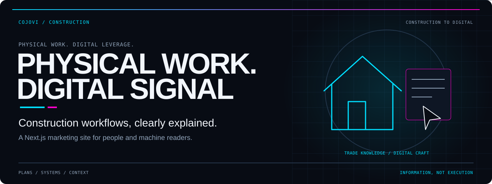
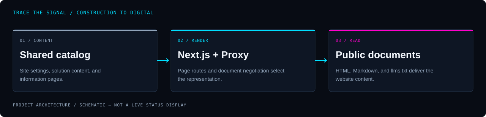

<!-- COJOVI / SIGNAL — Construction to Digital project edition. Keep with readme-assets/. -->
<a name="top"></a>

<p align="center">
  
</p>

<h1 align="center">Construction to Digital</h1>

<p align="center">
  <strong>Make construction workflows easier to understand—and the next conversation easier to start.</strong><br>
  A Next.js marketing site for construction software and custom AI agents, with public content for people and machine readers.
</p>

<p align="center">
  
</p>

<p align="center">
  <a href="#overview">Overview</a> ·
  <a href="#architecture">Architecture</a> ·
  <a href="#quickstart">Quickstart</a> ·
  <a href="#configuration">Configuration</a> ·
  <a href="#validation">Validation</a> ·
  <a href="#security">Boundaries</a>
</p>

---

<a name="overview"></a>
## `> meet_c2d`

**Construction to Digital is the public-facing website, not the product runtimes it describes.** It presents The Drafting Table, Material Intelligence, Project Agent, and Billing Agent through a shared solution catalog, individual landing pages, and an animated construction-themed interface.

The application uses **Next.js 16.3.4, React 19.2.8, TypeScript, Tailwind CSS 4, and Motion**. The package identifier remains `construction-to-digital`; the repository name is `construction_to_digital`.

| Explain | Explore | Read anywhere |
| :--- | :--- | :--- |
| Introduce construction workflows, product scope, and safeguards. | Switch between solution summaries and open dedicated landing pages. | Serve public information as HTML, Markdown, and an `llms.txt` index. |

> [!IMPORTANT]
> **Demo requests are email handoffs.** Buttons use a `mailto:` link; visitors review and send their own message. This repository does not implement a lead-submission API, blueprint upload service, customer dashboard, billing integration, or MCP server. Product statuses and integration names are marketing content, not proof of capabilities running inside this website.

<a name="architecture"></a>
## `> trace_the_signal`

<p align="center">
  
</p>

```text
Site settings + solution catalog + information pages
                         ↓
Next.js App Router + Markdown generators + Proxy
                         ↓
HTML pages / explicit .md URLs / negotiated Markdown / llms.txt
```

[Solution data](src/lib/solutions.ts) feeds the homepage portfolio, solution routes, and Markdown descriptions. [Information pages](src/lib/information-pages.ts) provide shared trust-page content. [Proxy](src/proxy.ts) selects document representations before the page cache and leaves framework Flight navigation intact.

The flow describes public content delivery, not an operational pipeline connecting construction or financial systems.

<a name="quickstart"></a>
## `> bring_it_online`

**Prerequisites:** Git, npm, and Node.js. Next.js declares Node `>=20.9.0`; the existing test guidance recommends **Node 22.18+** for native TypeScript stripping. Use that newer baseline if you intend to run the whole quality gate.

### 1. Install the source

```bash
git clone --branch main https://github.com/cojovi/construction_to_digital.git
cd construction_to_digital
npm ci
```

`npm ci` runs the repository's `postinstall` hook. Read [the compatibility patch](scripts/patch-next-vary.mjs): it changes two installed Next.js response templates to append rather than replace `Vary`. It accepts **Next 16.3.4 only** and fails when the expected patch target changes. Do not bypass that failure without reviewing the framework upgrade and cache behavior.

### 2. Start development

```bash
npm run dev
```

Open **http://localhost:3000**. No analytics credentials are required for the basic site. Font loading uses `next/font/google`; plan for network access when the framework fetches fonts during a build.

### 3. Build and serve

```bash
npm run build
npm start
```

Use a Next.js-capable host or Node server. The Proxy and negotiated document responses mean this is not documented as a plain static-file export. Recheck response headers through your actual reverse proxy or CDN before release.

<a name="configuration"></a>
## `> set_the_context`

Optional marketing settings are listed in [.env.example](.env.example). Copy it only when configuring those services:

```bash
cp .env.example .env.local
```

- **`NEXT_PUBLIC_GOOGLE_TAG_ID`** — Google Analytics or Google Ads tag identifier. Unset means the analytics component renders no tag scripts and installs no click listener.
- **`NEXT_PUBLIC_GOOGLE_SITE_VERIFICATION`** — Google site-verification metadata.
- **`NEXT_PUBLIC_BING_SITE_VERIFICATION`** — Bing site-verification metadata.

These are public browser/metadata identifiers, **not secret API keys**. Do not put credentials in `NEXT_PUBLIC_*` variables. Supply deployment values before building, and keep local configuration out of version control.

| Change | Source of truth |
| :--- | :--- |
| Brand, canonical URL, public contact, demo email template | [Site settings](src/lib/site.ts) |
| Product copy, published status, workflow, safeguards | [Solution catalog](src/lib/solutions.ts) |
| About, contact, privacy, agent guidance | [Information content](src/lib/information-pages.ts) |
| Security headers, image rules, legacy redirects | [Next configuration](next.config.ts) |
| Visual conventions | [Design system](design-system/construction-to-digital/MASTER.md) |

<a name="usage"></a>
## `> explore_the_pages`

### Public routes

- `/` — homepage, solution overview, and demo email links.
- `/solutions/drafting-table` — blueprint-to-takeoff product information.
- `/solutions/material-intelligence` — supplier-data product information.
- `/solutions/project-agent` — contractor-operations product information.
- `/solutions/billing-agent` — financial-operations product information.
- `/about`, `/contact`, `/privacy`, `/agents` — company and website information.
- `/llms.txt`, `/sitemap.xml`, `/robots.txt`, `/manifest.webmanifest` — discovery and platform metadata.

The retired `/solutions/bolt-agent` route redirects to `/solutions/project-agent`; the corresponding `.md` route also redirects.

### Machine-readable documents

Explicit URLs such as `/index.md`, `/contact.md`, and `/solutions/project-agent.md` work without a special header. Public page URLs also negotiate Markdown with `Accept: text/markdown`.

```bash
# Read-only examples against your local development server.
curl -i -H 'Accept: text/markdown' http://localhost:3000/
curl -i http://localhost:3000/solutions/project-agent.md
```

Missing documents return `404`; unsupported negotiated representations return `406`. Explicit Markdown endpoints accept only `GET` and `HEAD`. Markdown and negotiation errors use no-store cache headers; HTML retains framework caching. See [the negotiation helper](src/lib/content-negotiation.ts) and [Markdown generator](src/lib/markdown.ts).

<a name="validation"></a>
## `> check_before_ship`

```bash
npm test
npm run check
```

`npm test` runs the negotiation unit suite. `npm run check` chains ESLint, TypeScript, unit tests, a production build, and HTTP integration checks. The [HTTP suite](tests/http/agent-readiness.test.mjs) starts and stops its own loopback production server when `C2D_TEST_URL` is unset; it needs an existing build when run separately via `npm run test:http`.

`C2D_TEST_URL` switches that suite to an existing deployment. Leave it unset for local validation; only target a remote environment you are authorized to check.

**Builds and tests were not run for this docs-only task.** The commands describe the checked-in scripts, not a verified release result.

- [ ] Review changed solution copy in HTML and Markdown.
- [ ] Exercise keyboard navigation, mobile layout, and reduced-motion behavior.
- [ ] Confirm mail links target an owner-approved destination without sending test inquiries.
- [ ] Verify `Vary: Accept` alongside Next's RSC tokens after deployment.
- [ ] Check the privacy notice and consent requirements before enabling analytics.
- [ ] Reassess the Next.js compatibility patch whenever dependencies change.

<a name="source"></a>
## `> open_the_source`

| Path | Responsibility |
| :--- | :--- |
| [Homepage](src/app/page.tsx) | Marketing sections and solution links. |
| [Application layout](src/app/layout.tsx) | Fonts, global UI, metadata, structured data. |
| [Solution route](src/app/solutions/%5Bslug%5D/page.tsx) | Generated landing pages from catalog entries. |
| [Information route](src/app/%5Binformation%5D/page.tsx) | Shared information-page renderer. |
| [System console](src/components/hud/system-console.tsx) | Interactive solution selector, not live system telemetry. |
| [Analytics](src/components/marketing-analytics.tsx) | Optional Google tag and marked-link click events. |
| [Package manifest](package.json) | Exact dependencies and available scripts. |

<a name="security"></a>
## `> draw_the_boundary`

The configured security headers include a Content Security Policy, anti-framing protections, and production HSTS. These are application configuration—not a certification of deployment security. Review any proxy overrides and the CSP's allowed inline scripts/styles before changing integrations.

The introduction uses a session-storage preference; enabling the optional Google tag adds third-party processing. A lead-click event records a click, not proof that an email was sent. Keep customer records, confidential plans, passwords, and provider keys out of initial inquiries and repository content.

### Attribution and license

Maintained in **[cojovi/construction_to_digital](https://github.com/cojovi/construction_to_digital)**. No repository-level license file is present in the audited revision; do not assume unrestricted reuse. Dependency licenses and rights to branding/media remain separate.

---

<p align="center">
  
</p>

<p align="center">
  <strong>Physical work. Clear information. Deliberate next steps.</strong><br>
  <sub>A <a href="https://github.com/cojovi">Cody / cojovi</a> project · <a href="https://cojovi.com">cojovi.com</a><br>
  Construction to Digital · Presented in COJOVI / SIGNAL.</sub>
</p>

<p align="center"><a href="#top">↑ Back to the signal</a></p>
